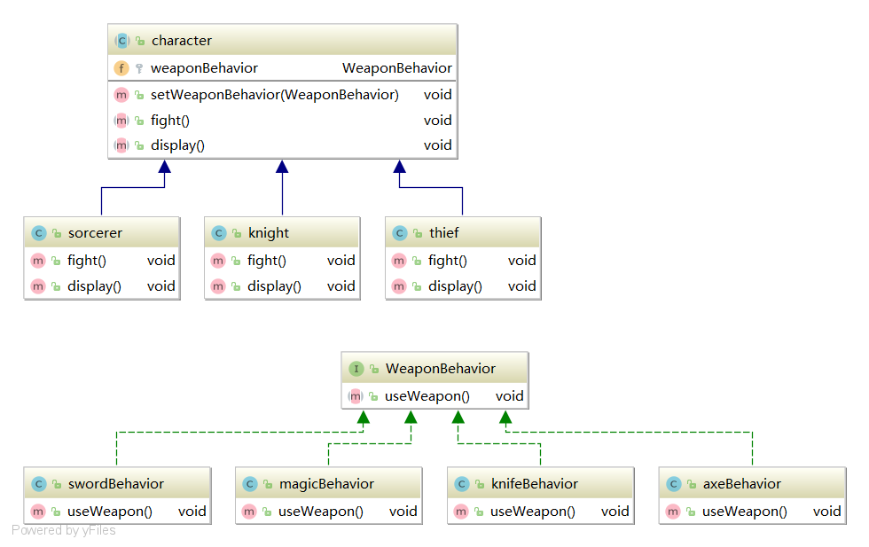
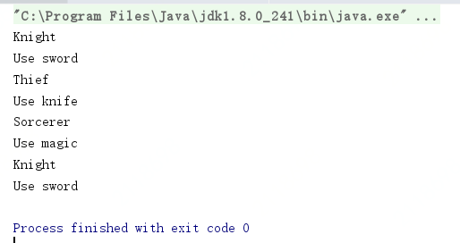

# <center>Design Mode阅读笔记</center>

<center>by chenxiangjie3@jd.com 8/4/2020</center>
##Chapter1 策略模式


---

## I.Background & Demands
继承自同一接口or抽象类的多个不同主体，它们需要有各自的行为。

1. 若直接在主体接口中或者抽象类中写入该行为的方法，会导致不符合预期的后果，因为有些行为是一些具体实现主体类所不具有的。
虽然可以通过覆盖将这些行为无效化，对于后面扩展的类来说也要做这项工作，可扩展性差。

2. 若将这些行为封装成接口，针对不同的主体实现类来实现不同的行为。 这样则会导致代码复用率低下，需要一遍遍去实现行为。

---

## II.Motivation
** Principles **
1. Seperate what changes from what stays the same.
 剥离需要变化的部分，保留静态未变的部分。
2. Program to an interface, not to an implementation.
 针对接口编程，而不是接口or抽象类。
3. Favor composition over inheritance.
 组合优于继承。

---

## III.Our Mode
** Strategy Mode ** 
1.在主体类封装行为变量，通过调用变量的方法来conduct 行为。
2.设计算法族，refer to这组行为 as a family of algorithms(算法族)。

** Adaptations **
增添私有方法变量的Setter方法，可以在程序运行时动态调整主体类的行为。

---
## IV.Example

using "Design Puzzle" @Page 25

---
** UML Graph **


** Test Class **
```
        character Nxy = new knight();
        character Luis = new thief();
        character Ziv = new sorcerer();

        Nxy.setWeaponBehavior(new swordBehavior());
        Nxy.display();
        Nxy.fight();

        Luis.setWeaponBehavior(new knifeBehavior());
        Luis.display();
        Luis.fight();

        Ziv.setWeaponBehavior(new magicBehavior());
        Ziv.display();
        Ziv.fight();

        Luis.setWeaponBehavior(new axeBehavior());
        Nxy.display();
        Nxy.fight();
```

** Result **


---

## V.Evaluation 
** pros **
1.利用了OO继承带来的代码复用(算法族)，减少代码冗余。
2.行为与行为主体分离，减少耦合。
3.可以在程序中动态调整主体类的行为而不需要Program to implementations。
4.扩展性良好。

** cons **
1.方法类会增多。
2.所有方法实现类会对外暴露。

---

## VI.Scenarios
1.系统里若干对象有许多行为，彼此之间行为不尽相同，有些对象不能使用某些行为。
2.这些行为有许多不同的实现方法，一个对象的行为实现方法可能在运行过程中改变。
3.将1.2.中行为替换成算法，系统中可能需要切换算法。

---

<center>Copy © 2020 Raccoon_C</center>
